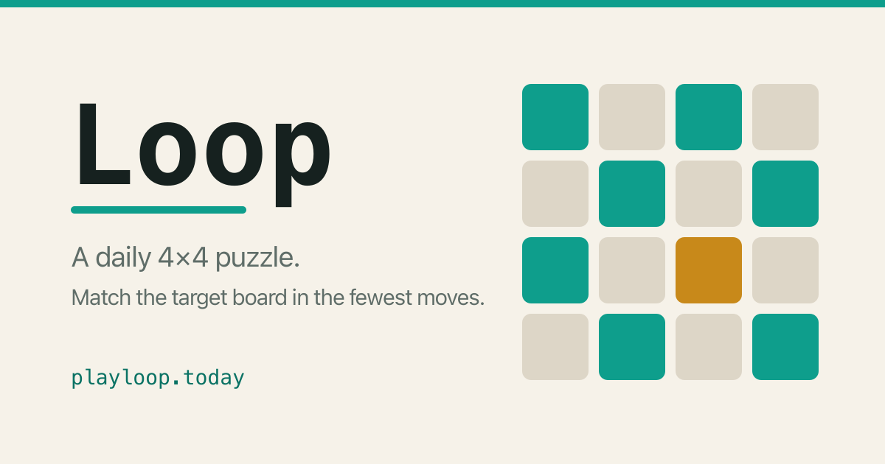

# Loop



A daily 4×4 puzzle. Shift individual rows and columns to turn the scrambled board
into the target — in as few moves as possible. One new puzzle for everyone, every
day. No accounts, no backend.

**▶ Play: [https://playloop.today/](https://playloop.today/?ref=github)**

## How to play

- Each control shifts a single row or column, cyclically (a tile pushed off one
  edge wraps back in on the other).
- Match your board to the **target** shown at the top.
- **Par** is the optimal solution — the fewest moves the puzzle can be solved in.
  Match it for an "Optimal" finish, or give up to watch the solution play out.
- Come back tomorrow for a fresh one.

## How it works

The puzzle is deterministic from the calendar date: the date seeds a PRNG that
generates the target and scrambles it, so everyone gets the same board each day —
no server required. **Par** is computed with a breadth-first search for the
shortest path back to the target. Progress and streaks are kept in `localStorage`.

## Tech

React 19 · TypeScript · Vite · CSS Modules + design tokens · Web Animations API ·
Vitest. Deployed to GitHub Pages via GitHub Actions.

## Development

Requires Node `>=20.19 <21` or `>=22.12`.

```bash
npm install
npm run dev      # start the dev server
npm test         # run the game-logic tests
npm run build    # type-check + production build
npm run lint     # lint
```

There's also a component sandbox at `?sandbox` in dev, for viewing every UI state
with mock data.

## License

[MIT](LICENSE) © 2026 Ralf Oliveira
